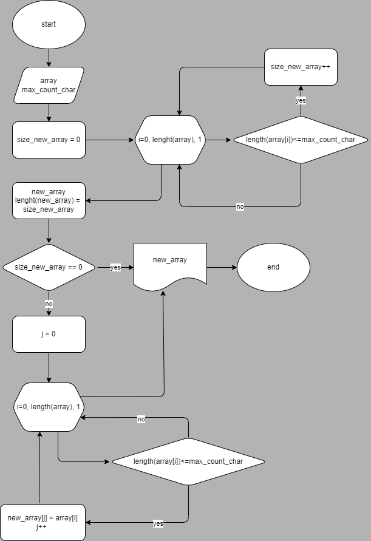

# **Программа для создания массива строк, на основе выборки элементов определенной длины из входящего массива**

1. ## Функция подсчета элементов подходящей длины в исходном массиве

2. ## Основная функция для создания нового массива

    * Определяем размер нового массива за счет первой функции
    * Возвращаем пустой новый массив, если элементов не найдено
    * Заполняем массив подходящими элементами, если найден хотябы один и возвращаем новый массив

---

